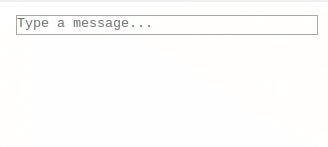

# vue-chat-autosize-typebox

[](https://npmjs.com/package/vue-highlighter)
[](https://npmjs.com/package/vue-highlighter)
[](https://travis-ci.org/TonPC64/vue-chat-autosize-typebox)

> Vue component of typebox chat with autosize.

## [DEMO](http://vue-chat-autosize-typebox.surge.sh/)

<p style="text-align: center;">
  
</p>

## Install

```js
import Vue from 'vue';
import ChatTypeBox from 'vue-chat-autosize-typebox';

Vue.component('ChatTypeBox', ChatTypeBox);
```

## Usage

```html
<ChatTypeBox v-model="text" @send="send"/>
```

## Events

| Name | defualt parameter | Description                                          |
| :--- | :---------------- | ---------------------------------------------------- |
| send | (text)            | emit trim message to event, if empty string not send |

## Props

| Name        | Type   | Default             | Description                    |
| :---------- | :----- | :------------------ | :----------------------------- |
| v-model     | string |                     | binding data (required)        |
| maxHight    | Number | 164                 | max height of typebox          |
| minHeight   | Number | 18                  | min height of typebox          |
| maxLength   | Number | 640                 | limit length of message        |
| placeholder | string | 'Type a message...' | placeholder message in typebox |
